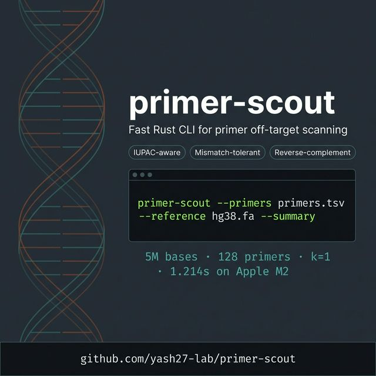

# primer-scout



`primer-scout` is a high-speed Rust CLI for **primer off-target scanning** on FASTA references.

It is built for teams that need:
- fast preflight checks before expensive downstream workflows
- reproducible and script-friendly results
- simple deployment (single binary, no Python runtime required)

## Why This Exists

Many labs and bio teams face the same workflow gap:
- BLAST/aligners are powerful but heavy for quick panel screening loops
- grep-like tools are fast but usually lack primer-aware summary outputs
- ad-hoc scripts are hard to maintain and benchmark consistently

`primer-scout` targets that middle layer: quick, repeatable, production-friendly primer specificity checks.

## Clinical Disclaimer

`primer-scout` is for research and engineering workflows only.
It is not a medical device and must not be used for medical diagnosis, treatment decisions, or patient-facing clinical decisions.

## Is It Solving What People Want?

Yes, for these real needs:
- "Check panel specificity fast across one or many references."
- "Allow a controlled mismatch threshold and inspect all hit coordinates."
- "Integrate into CI/pipelines with stable machine-readable output."

No, for these advanced needs (out of scope today):
- thermodynamic scoring (Tm, dimer, hairpin)
- gapped alignment or indel-aware search
- full amplicon pair simulation and product-size modeling

Use `primer-scout` as a **high-throughput screening layer**, then move shortlisted candidates to deeper tools.

## Core Features

- Rust single-binary CLI
- FASTA input, including `.gz`
- Primer panel input as TSV/CSV
- IUPAC-aware matching (`A C G T/U R Y S W K M B D H V N`)
- Configurable mismatch threshold (`--max-mismatches`)
- Reverse-complement scanning enabled by default
- Parallel execution (`--threads`)
- Hit-level row output
- Per-primer summary output
- Count-only output
- TSV or NDJSON output

## Real Use Cases

1. Primer panel preflight before sequencing runs:
   Scan host genome + contamination references and rank primers by hit burden.
2. Off-target triage in assay development:
   Quickly identify primers with many near-matches at `k=1` or `k=2`.
3. CI regression checks:
   Re-run panel scans when primer files change and fail builds if hit counts jump.
4. Multi-reference screening:
   Test one panel against many assemblies without rewriting custom scripts.
5. Large-scale filtering:
   Use count-only mode for fast dashboards and trend tracking.

## Install and Run (macOS and Windows)

### macOS (zsh/bash)

```bash
# 1) Install Rust toolchain
xcode-select --install || true
curl https://sh.rustup.rs -sSf | sh -s -- -y
source "$HOME/.cargo/env"

# 2) Install primer-scout from GitHub
cargo install --git https://github.com/yash27-lab/primer-scout --branch main --force

# 3) Verify install
primer-scout --help

# 4) Smoke test
git clone https://github.com/yash27-lab/primer-scout.git
cd primer-scout
primer-scout --primers data/demo_primers.tsv --reference data/demo.fa --count-only
```

Expected smoke-test output:

```text
27
```

Installed commands:
- `primer` (interactive console + CLI entrypoint)
- `primer-scout` (direct scanner command)

If `primer: command not found` appears:

```bash
echo 'export PATH="$HOME/.cargo/bin:$PATH"' >> ~/.bash_profile
source ~/.bash_profile
```

For zsh:

```bash
echo 'export PATH="$HOME/.cargo/bin:$PATH"' >> ~/.zshrc
source ~/.zshrc
```

### Windows (PowerShell)

```powershell
# 1) Install Rust toolchain
winget install --id Rustlang.Rustup -e
rustup default stable-x86_64-pc-windows-msvc

# 2) Install primer-scout from GitHub
cargo install --git https://github.com/yash27-lab/primer-scout --branch main --force

# 3) Verify install
primer-scout --help

# 4) Smoke test
git clone https://github.com/yash27-lab/primer-scout.git
cd primer-scout
primer-scout --primers data\demo_primers.tsv --reference data\demo.fa --count-only
```

Expected smoke-test output:

```text
27
```

### Build from local source

```bash
cargo install --path .
```

## Input Format

Primer file (`.tsv` or `.csv`):

```text
name	sequence
primer_1	ATGCCGTAGCTA
primer_2	TTYACCGGTTAA
```

`name` is optional. If missing, names are auto-generated.

Reference input:
- one or more FASTA files with `--reference`
- plain or `.gz`

## Quick Start

Open interactive console:

```bash
primer
```

Open console explicitly (same mode):

```bash
primer --splash
```

`primer` console behavior:
- runs in its own full-screen terminal view (separate from normal bash prompt)
- exit with `Ctrl+C` or by typing `x` then Enter
- automatically saves session history before exit
- auto-restores previous history on next launch
- shows update banner when a newer GitHub release is available
- typing `/` shows live command suggestions (type-ahead filter)
- accepts both `/scan ...` and direct `primer-scout ...` style commands

Inside console:

```text
/help
/basics
/examples
/scan --primers data/demo_primers.tsv --reference data/demo.fa --summary
primer-scout --primers data/demo_primers.tsv --reference data/demo.fa --count-only
--primers data/demo_primers.tsv --reference data/demo.fa --summary
/upgrade
/version
/history
/clear
x
```

Direct help:

```bash
primer --help
```

Hit-level scan:

```bash
primer-scout \
  --primers data/demo_primers.tsv \
  --reference data/demo.fa \
  --max-mismatches 1
```

Per-primer summary:

```bash
primer-scout \
  --primers data/demo_primers.tsv \
  --reference data/demo.fa \
  --summary
```

Count-only:

```bash
primer-scout \
  --primers data/demo_primers.tsv \
  --reference data/demo.fa \
  --count-only
```

JSON output:

```bash
primer-scout \
  --primers data/demo_primers.tsv \
  --reference data/demo.fa \
  --summary \
  --json
```

Disable reverse-complement scanning:

```bash
primer-scout \
  --primers data/demo_primers.tsv \
  --reference data/demo.fa \
  --no-revcomp
```

## Command Reference

### `primer` (interactive)

```bash
primer
```

Starts full-screen console with session restore.

```bash
primer --splash
```

Explicitly opens the same full-screen console.

```bash
primer --help
```

Shows CLI options for direct non-interactive scan mode.

### Console commands inside `primer`

- `/help`: full command list and usage.
- `/basics`: beginner quickstart commands.
- `/examples`: more advanced scan examples.
- `/scan <args>`: run real `primer-scout` scan command.
- direct `primer-scout <args>`: also supported inside console.
- direct `<args>` (starting with `--`): also supported inside console.
- `/upgrade`: print one-line upgrade command.
- `/version`: show installed version.
- `/history`: show saved session file path.
- `/clear`: clear visible console history.
- `x` or `/exit` or `Ctrl+C`: save session and quit console.

### `primer-scout` (direct scanner)

```bash
primer-scout --help
```

Shows all scanner flags.

```bash
primer-scout --primers <primers.tsv> --reference <ref.fa> --count-only
```

Returns only total hit count (fast sanity check).

```bash
primer-scout --primers <primers.tsv> --reference <ref.fa> --summary
```

Returns per-primer aggregated stats.

```bash
primer-scout --primers <primers.tsv> --reference <ref.fa> --json
```

Outputs NDJSON rows for pipeline ingestion.

```bash
primer-scout --primers <primers.tsv> --reference <ref.fa> --max-mismatches 2
```

Allows fuzzy matching with up to 2 substitutions.

## Security and Safety Defaults

- Console session history is stored under `$HOME/.primer-scout/` with restricted permissions (`0700` dir, `0600` file on Unix).
- `PRIMER_SCOUT_SESSION_FILE` is path-sanitized and cannot point outside `$HOME/.primer-scout/`.
- Symlink targets are rejected for session history writes.
- Resource guards are enabled by default to reduce denial-of-service risk from malformed or huge input files.

Runtime safety limits (override only when needed):

- `PRIMER_SCOUT_MAX_PRIMER_FILE_BYTES` default: `16777216` (16 MiB)
- `PRIMER_SCOUT_MAX_PRIMER_LINE_BYTES` default: `32768` (32 KiB)
- `PRIMER_SCOUT_MAX_FASTA_LINE_BYTES` default: `8388608` (8 MiB)
- `PRIMER_SCOUT_MAX_CONTIG_BASES` default: `250000000` (250M bases per contig)

Example override:

```bash
PRIMER_SCOUT_MAX_CONTIG_BASES=350000000 primer-scout --primers panel.tsv --reference hg38.fa --summary
```

## Upgrade and Uninstall

Upgrade to latest:

```bash
cargo install --git https://github.com/yash27-lab/primer-scout --branch main --force
```

Pin install to a release tag:

```bash
cargo install --git https://github.com/yash27-lab/primer-scout --tag v0.1.0 --force
```

Uninstall:

```bash
cargo uninstall primer-scout
```

## Output Contracts

Hit-level TSV columns:

```text
file  contig  primer  primer_len  start  end  strand  mismatches  matched
```

Summary TSV columns:

```text
primer  primer_len  total_hits  perfect_hits  forward_hits  reverse_hits  contigs_with_hits
```

Coordinate system: 0-based, half-open `[start, end)`.

## Performance And Benchmarking

This project does not claim performance without reproducible evidence.

Run the macro benchmark:

```bash
./scripts/run_benchmark.sh
```

Artifacts produced:
- `benchmarks/RESULTS.md`
- `benchmarks/generated/timings.csv`

Run microbenchmarks:

```bash
cargo bench --bench engine
```

Artifacts:
- `benchmarks/CRITERION_RESULTS.md`

Latest local macro run (2026-02-18, Apple M2, 8 threads):
- dataset: 5,000,000 bases, 128 primers, length 20, `k=1`
- mean runtime: 1.214 s
- throughput: 4.119 million-bases/s

## Development

```bash
cargo fmt --all
cargo clippy --all-targets --all-features -- -D warnings
cargo test --all-targets --all-features
```

## Project Ops

- Contributing guide: `CONTRIBUTING.md`
- Changelog: `CHANGELOG.md`
- Release notes: `releases/v0.1.0.md`
- GitHub launch metadata: `docs/github-launch.md`

## License

MIT
