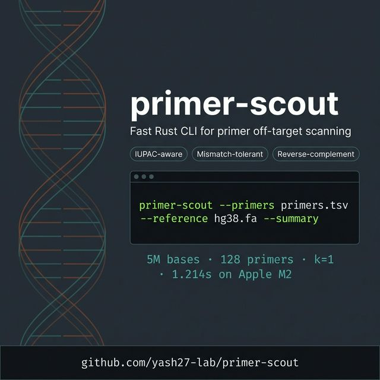

# primer-scout

[](https://github.com/yash27-lab/primer-scout/actions/workflows/ci.yml)
[](LICENSE)
[](https://www.rust-lang.org)



**`primer-scout` is a fast, single-binary Rust CLI for primer off-target scanning on FASTA references.**

Point it at a primer panel and one or more references; it reports every place each
primer (and its reverse complement) matches — exact or within a mismatch budget —
as stable, script-friendly TSV or NDJSON.

```bash
primer-scout --primers panel.tsv --reference genome.fa --summary
```

---

## Contents

- [The problem](#the-problem)
- [Where primer-scout fits](#where-primer-scout-fits)
- [Why it's open source](#why-its-open-source)
- [Clinical disclaimer](#clinical-disclaimer)
- [Features](#features)
- [Install and run](#install-and-run-macos-and-windows)
- [Quick start](#quick-start)
- [Command reference](#command-reference)
- [Input and output formats](#input-format)
- [Security and safety defaults](#security-and-safety-defaults)
- [Performance and benchmarking](#performance-and-benchmarking)
- [Development](#development)
- [License](#license)

## The problem

Before any PCR, sequencing, or panel run, you want a quick answer to a simple
question: **"where else do my primers stick?"** A primer that matches dozens of
off-target sites — or whose reverse complement does — wastes reagents, muddies
results, and is cheaper to catch on a laptop than in the lab.

In practice the existing options each have a rough edge for this specific check:

- **Full aligners (BLAST and friends)** are powerful and sensitive, but they are
  heavy to set up and slower than you want for a tight "edit panel → re-screen"
  loop, and their output needs parsing before it answers a primer-level question.
- **`grep` / ripgrep** are blazing fast but DNA-naive: no IUPAC ambiguity codes,
  no reverse-complement search, no mismatch tolerance, and no per-primer summary.
- **Ad-hoc scripts** fill the gap but tend to be unmaintained, un-benchmarked, and
  inconsistent from one team to the next.

`primer-scout` targets exactly that middle layer: **quick, repeatable,
automation-friendly primer specificity screening**, with the DNA semantics that a
plain text search lacks.

## Where primer-scout fits

| Tool | Best at | Why it's awkward for fast panel screening |
| --- | --- | --- |
| BLAST / aligners | Sensitive, gapped, indel-aware alignment | Heavier setup, slower for repeated quick sweeps, output needs post-processing |
| `grep` / ripgrep | Raw exact/regex search speed | No IUPAC codes, no reverse complement, no mismatch budget, no primer-level rollups |
| Ad-hoc scripts | Flexibility | Hard to maintain, rarely tested or benchmarked, inconsistent across teams |
| **primer-scout** | Fast IUPAC- and revcomp-aware screening with stable machine output | Screening layer only — not a replacement for deep alignment |

Use `primer-scout` as a **high-throughput screening pass**, then move the
shortlisted candidates to deeper, slower tools.

**In scope today:**

- Scan a panel against one or many references, fast.
- Allow a controlled mismatch threshold and inspect every hit coordinate.
- Produce stable machine-readable output for CI and pipelines.

**Out of scope (by design):**

- Thermodynamic scoring (Tm, dimers, hairpins).
- Gapped / indel-aware alignment.
- Full amplicon-pair simulation and product-size modeling.

## Why it's open source

`primer-scout` is MIT-licensed and intended to stay that way. Specificity
pre-checks are infrastructure, not a product — they belong in the open where labs
and pipelines can read the matching logic, reproduce the benchmarks, and trust the
output contracts instead of treating them as a black box.

What that commitment looks like in the repo:

- **MIT license**, no contributor license assignment, no telemetry.
- **Reproducible benchmarks** rather than marketing numbers (see
  [Performance](#performance-and-benchmarking)).
- **Tested, linted CI** on every push, plus an automated `cargo audit`
  dependency-vulnerability scan.
- **Documented, stable [output contracts](#output-contracts)** so downstream
  scripts don't break silently.

Contributions are welcome — see [`CONTRIBUTING.md`](CONTRIBUTING.md). Security
reports have a private channel described in [`SECURITY.md`](SECURITY.md).

## Clinical disclaimer

`primer-scout` is for research and engineering workflows only. It is **not a
medical device** and must not be used for medical diagnosis, treatment decisions,
or patient-facing clinical decisions.

## Features

- Rust single-binary CLI (no Python runtime to manage)
- FASTA input, including `.gz`
- Primer panel input as TSV/CSV
- IUPAC-aware matching (`A C G T/U R Y S W K M B D H V N`)
- Configurable mismatch threshold (`--max-mismatches`)
- Reverse-complement scanning enabled by default
- Parallel execution (`--threads`)
- Three output modes: hit-level rows, per-primer summary, count-only
- TSV or NDJSON output for pipeline ingestion
- Resource guards for safe processing of untrusted input files

## Install and run (macOS and Windows)

### macOS (zsh/bash)

```bash
# 1) Install Rust toolchain
xcode-select --install || true
curl https://sh.rustup.rs -sSf | sh -s -- -y
source "$HOME/.cargo/env"

# 2) Install primer-scout from GitHub
cargo install --git https://github.com/yash27-lab/primer-scout --branch main --force

# 3) Verify install
primer-scout --help

# 4) Smoke test
git clone https://github.com/yash27-lab/primer-scout.git
cd primer-scout
primer-scout --primers data/demo_primers.tsv --reference data/demo.fa --count-only
```

Expected smoke-test output:

```text
27
```

Installed commands:
- `primer` (interactive console + CLI entrypoint)
- `primer-scout` (direct scanner command)

If `primer: command not found` appears:

```bash
echo 'export PATH="$HOME/.cargo/bin:$PATH"' >> ~/.bash_profile
source ~/.bash_profile
```

For zsh:

```bash
echo 'export PATH="$HOME/.cargo/bin:$PATH"' >> ~/.zshrc
source ~/.zshrc
```

### Windows (PowerShell)

```powershell
# 1) Install Rust toolchain
winget install --id Rustlang.Rustup -e
rustup default stable-x86_64-pc-windows-msvc

# 2) Install primer-scout from GitHub
cargo install --git https://github.com/yash27-lab/primer-scout --branch main --force

# 3) Verify install
primer-scout --help

# 4) Smoke test
git clone https://github.com/yash27-lab/primer-scout.git
cd primer-scout
primer-scout --primers data\demo_primers.tsv --reference data\demo.fa --count-only
```

Expected smoke-test output:

```text
27
```

### Build from local source

```bash
cargo install --path .
```

## Quick start

Open the interactive console:

```bash
primer
```

Open the console explicitly (same mode):

```bash
primer --splash
```

`primer` console behavior:
- runs in its own full-screen terminal view (separate from your normal shell prompt)
- exit with `Ctrl+C` or by typing `x` then Enter
- automatically saves session history before exit
- auto-restores previous history on next launch
- shows an update banner when a newer GitHub release is available
- typing `/` shows live command suggestions (type-ahead filter)
- accepts both `/scan ...` and direct `primer-scout ...` style commands

Inside the console:

```text
/help
/basics
/examples
/scan --primers data/demo_primers.tsv --reference data/demo.fa --summary
primer-scout --primers data/demo_primers.tsv --reference data/demo.fa --count-only
--primers data/demo_primers.tsv --reference data/demo.fa --summary
/upgrade
/version
/history
/clear
x
```

### Direct (non-interactive) scans

Per-primer summary against the bundled demo data:

```bash
primer-scout --primers data/demo_primers.tsv --reference data/demo.fa --summary
```

```text
p_ambig 4   14  8   8   6   2
p_atgc  4   12  7   7   5   2
p_gatc  4   1   1   1   0   1
```

Hit-level scan with one allowed mismatch:

```bash
primer-scout \
  --primers data/demo_primers.tsv \
  --reference data/demo.fa \
  --max-mismatches 1
```

Count-only (fast sanity check):

```bash
primer-scout \
  --primers data/demo_primers.tsv \
  --reference data/demo.fa \
  --count-only
```

NDJSON output for pipelines:

```bash
primer-scout \
  --primers data/demo_primers.tsv \
  --reference data/demo.fa \
  --summary \
  --json
```

Disable reverse-complement scanning:

```bash
primer-scout \
  --primers data/demo_primers.tsv \
  --reference data/demo.fa \
  --no-revcomp
```

## Example use cases

1. **Primer panel preflight before sequencing runs** — scan host genome plus
   contamination references and rank primers by hit burden.
2. **Off-target triage in assay development** — quickly flag primers with many
   near-matches at `k=1` or `k=2`.
3. **CI regression checks** — re-run panel scans when primer files change and fail
   the build if hit counts jump.
4. **Multi-reference screening** — test one panel against many assemblies without
   rewriting custom scripts.
5. **Large-scale filtering** — use count-only mode for fast dashboards and trend
   tracking.

## Command reference

### `primer` (interactive)

```bash
primer            # full-screen console with session restore
primer --splash   # explicitly open the same console
primer --help     # show CLI options for direct, non-interactive scan mode
```

### Console commands inside `primer`

- `/help`: full command list and usage.
- `/basics`: beginner quickstart commands.
- `/examples`: more advanced scan examples.
- `/scan <args>`: run a real `primer-scout` scan.
- direct `primer-scout <args>`: also supported inside the console.
- direct `<args>` (starting with `--`): also supported inside the console.
- `/upgrade`: print the one-line upgrade command.
- `/version`: show installed version.
- `/history`: show the saved session file path.
- `/clear`: clear the visible console history.
- `x` or `/exit` or `Ctrl+C`: save the session and quit.

### `primer-scout` (direct scanner)

```bash
primer-scout --help                                       # all scanner flags
primer-scout --primers <p.tsv> --reference <ref.fa> --count-only   # total hit count
primer-scout --primers <p.tsv> --reference <ref.fa> --summary      # per-primer stats
primer-scout --primers <p.tsv> --reference <ref.fa> --json         # NDJSON rows
primer-scout --primers <p.tsv> --reference <ref.fa> --max-mismatches 2   # fuzzy match
```

## Input format

Primer file (`.tsv` or `.csv`):

```text
name	sequence
primer_1	ATGCCGTAGCTA
primer_2	TTYACCGGTTAA
```

`name` is optional. If missing, names are auto-generated.

Reference input:
- one or more FASTA files with `--reference`
- plain text or `.gz`

## Output contracts

Hit-level TSV columns:

```text
file  contig  primer  primer_len  start  end  strand  mismatches  matched
```

Summary TSV columns:

```text
primer  primer_len  total_hits  perfect_hits  forward_hits  reverse_hits  contigs_with_hits
```

Coordinate system: 0-based, half-open `[start, end)`.

## Security and safety defaults

`primer-scout` is built to process **untrusted input files** safely. See
[`SECURITY.md`](SECURITY.md) for the full policy and how to report a vulnerability.

- Console session history is stored under `$HOME/.primer-scout/` with restricted
  permissions (`0700` dir, `0600` file on Unix).
- `PRIMER_SCOUT_SESSION_FILE` is path-sanitized and cannot point outside
  `$HOME/.primer-scout/`; symlink targets are rejected.
- The console runs the scanner binary installed alongside it rather than resolving
  the bare name through `PATH`.
- Resource guards are enabled by default to reduce denial-of-service risk from
  malformed or huge input files.
- The only outbound network call is an optional GitHub release check, disabled with
  `PRIMER_SCOUT_NO_UPDATE_CHECK=1`.

Runtime safety limits (override only when needed):

- `PRIMER_SCOUT_MAX_PRIMER_FILE_BYTES` default: `16777216` (16 MiB)
- `PRIMER_SCOUT_MAX_PRIMER_LINE_BYTES` default: `32768` (32 KiB)
- `PRIMER_SCOUT_MAX_FASTA_LINE_BYTES` default: `8388608` (8 MiB)
- `PRIMER_SCOUT_MAX_CONTIG_BASES` default: `250000000` (250M bases per contig)

Example override:

```bash
PRIMER_SCOUT_MAX_CONTIG_BASES=350000000 primer-scout --primers panel.tsv --reference hg38.fa --summary
```

## Upgrade and uninstall

Upgrade to latest:

```bash
cargo install --git https://github.com/yash27-lab/primer-scout --branch main --force
```

Pin install to a release tag:

```bash
cargo install --git https://github.com/yash27-lab/primer-scout --tag v0.1.0 --force
```

Uninstall:

```bash
cargo uninstall primer-scout
```

## Performance and benchmarking

This project does not claim performance without reproducible evidence.

Run the macro benchmark:

```bash
./scripts/run_benchmark.sh
```

Artifacts produced:
- `benchmarks/RESULTS.md`
- `benchmarks/generated/timings.csv`

Run microbenchmarks:

```bash
cargo bench --bench engine
```

Artifacts:
- `benchmarks/CRITERION_RESULTS.md`

Latest local macro run (2026-02-18, Apple M2, 8 threads):
- dataset: 5,000,000 bases, 128 primers, length 20, `k=1`
- mean runtime: 1.214 s
- throughput: 4.119 million-bases/s

Numbers are hardware- and input-dependent; re-run the scripts on your own machine
for figures you can trust.

## Development

```bash
cargo fmt --all
cargo clippy --all-targets --all-features -- -D warnings
cargo test --all-targets --all-features
cargo audit   # dependency vulnerability scan (install with `cargo install cargo-audit`)
```

## Project ops

- Contributing guide: [`CONTRIBUTING.md`](CONTRIBUTING.md)
- Security policy: [`SECURITY.md`](SECURITY.md)
- Changelog: [`CHANGELOG.md`](CHANGELOG.md)
- Release notes: [`releases/v0.1.0.md`](releases/v0.1.0.md)
- GitHub launch metadata: [`docs/github-launch.md`](docs/github-launch.md)

## License

[MIT](LICENSE)
